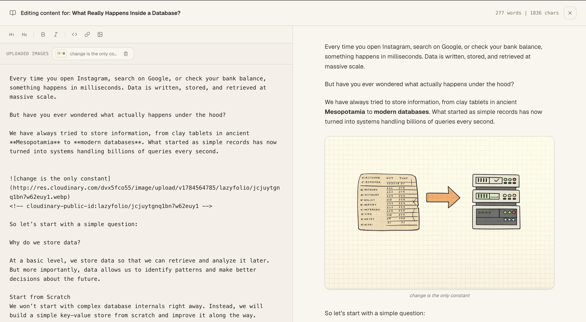

<p align="center">
  <!-- Replace the src below with your actual logo path once added -->
  
</p>

<h1 align="center">Lazyfolio</h1>

<p align="center">
  Make the internet know you exist.
  <br />
  Build your portfolio in minutes, not after hours of tweaking layouts and writing everything from scratch.
</p>

<p align="center">
  <a href="https://lazy-folio.vercel.app">Live Demo</a> &nbsp;|&nbsp;
  <a href="https://github.com/Angshuman09/lazyfolio/issues">Report Bug</a> &nbsp;|&nbsp;
  <a href="https://github.com/Angshuman09/lazyfolio/issues">Request Feature</a> &nbsp;|&nbsp;
  <a href="./CODE_OF_CONDUCT.md">Code of Conduct</a> &nbsp;|&nbsp;
  <a href="./LICENSE">License</a> &nbsp;|&nbsp;
</p>

--- 

## What is Lazyfolio

Most portfolio sites take an evening (or a weekend) you didn't want to spend picking a layout, wiring up a CMS, wrestling with deploys. Lazyfolio skips all of that. Pick a template, fill in your story, and you have a live, shareable portfolio with your own link, blog, and analytics in minutes.

It's fully open source, so you're welcome to self-host it, theme it, or rip out the parts you like for your own project.

**Features**

- One public profile page under `lazyfolio.com/your-username` that you can share anywhere. 
- Beautiful, developer-focused templates that need no customisation beyond your own content. 
- A built-in blogging engine so you can publish articles and writing alongside your work.
- A built-in analytics dashboard that tracks visitors, link clicks, and engagement over time. 

---


### Lazyfolio Dashboard Preview


### Write & Publish Blogs


 ---

## Getting Started

**Prerequisites**

Node.js 18 or later, a PostgreSQL database, and accounts on Cloudinary and your chosen auth provider.

**Clone the repository**

```bash
git clone https://github.com/Angshuman09/lazyfolio.git
cd lazyfolio
```

**Install dependencies**

```bash
npm install
```

**Set up environment variables**

Create a `.env` file at the root of the project. You will need values for your PostgreSQL connection string, Cloudinary credentials, and better-auth secret.

```env
DATABASE_URL="your-postgres-url"
NODE_ENV = "development"
BETTER_AUTH_SECRET="your-better-auth-secret"
BETTER_AUTH_URL= http://localhost:3000
GOOGLE_CLIENT_ID= your-google-client-id
GOOGLE_CLIENT_SECRET= your-google-client-secret
GITHUB_CLIENT_ID= your-github-client-id
GITHUB_CLIENT_SECRET= your-github-cilent-secret
NEXT_PUBLIC_CLOUDINARY_CLOUD_NAME= your-cloudinary-name
NEXT_PUBLIC_CLOUDINARY_API_KEY= your-cloudinary-api-key
NEXT_PUBLIC_CLOUDINARY_API_SECRET= your-cloudinary-api-secret
NEXT_PUBLIC_UMAMI_WEBSITE_ID= your-umami-website-id
NEXT_PUBLIC_UMAMI_SCRIPT_URL=https://cloud.umami.is/script.js
NODE_ENV= development
NEXT_PUBLIC_SITE_URL= http://localhost:3000
```

**Run database migrations**

```bash
npx prisma migrate dev
```

**Start the development server**

```bash
npm run dev
```

The app will be available at `http://localhost:3000`.

**Build for production**

```bash
npm run build
npm start
```


## Inspiration

Lazyfolio is directly inspired by two products that got the philosophy right.

[Linktree](https://linktr.ee) proved that a single shareable link page has enormous value for creators. Lazyfolio extends that idea with portfolio sections, project showcases, and a blogging layer built in from the start.

[Bear Blog](https://bearblog.dev) demonstrated that a writing platform does not need to be complicated. Clean, fast, and focused on the words. Lazyfolio borrows that same spirit for its built-in blog.

## Contributing

Contributions are welcome. Open an issue to discuss what you want to change before submitting a pull request. Please keep PRs focused on a single concern.

## License

Open-source and free. See `LICENSE` for details.

---

Built with ♥ by [Angshuman](https://github.com/Angshuman09)