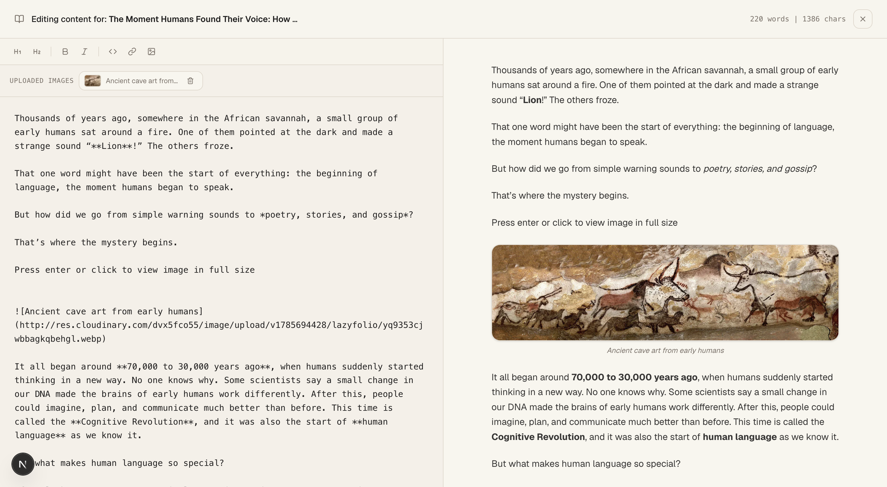

<p align="center">
  
</p>

<h1 align="center">Lazyfolio</h1>

<p align="center">
  Make the internet know you exist.
  <br />
  Build your portfolio in minutes, not after hours of tweaking layouts and writing everything from scratch.
</p>

<p align="center">
  <a href="https://lazy-folio.vercel.app">Live Demo</a> &nbsp;|&nbsp;
  <a href="https://github.com/Angshuman09/lazyfolio/issues">Report Bug</a> &nbsp;|&nbsp;
  <a href="https://github.com/Angshuman09/lazyfolio/issues">Request Feature</a> &nbsp;|&nbsp;
  <a href="./CODE_OF_CONDUCT.md">Code of Conduct</a> &nbsp;|&nbsp;
  <a href="./LICENSE">License</a>
</p>

<p align="center">
  
  
  
  
  
</p>

---

## Table of Contents

- [What is Lazyfolio](#what-is-lazyfolio)
- [Preview](#preview)
- [Getting Started](#getting-started)
- [Inspiration](#inspiration)
- [Contributing](#contributing)
- [License](#license)

---

## What is Lazyfolio

Most portfolio sites take an evening (or a weekend) you didn't want to spend picking a layout, wiring up a CMS, and wrestling with deploys. Lazyfolio skips all of that. Pick a template, fill in your story, and you have a live, shareable portfolio with your own link, blog, and analytics in minutes.

**Features**

- A public profile page you can share anywhere
- Beautiful, developer-focused templates that need no customization beyond your own content
- A built-in blogging engine so you can publish articles and writing alongside your work
- A built-in analytics dashboard that tracks visitors, link clicks, and engagement over time

---

## Preview

### Dashboard


### Write & Publish Blogs



---

## Getting Started

### Prerequisites

- Node.js 18 or later
- A PostgreSQL database
- A [Cloudinary](https://cloudinary.com) account
- OAuth credentials from your chosen auth provider(s) (Google, GitHub)

### Installation

**1. Clone the repository**

```bash
git clone https://github.com/Angshuman09/lazyfolio.git
cd lazyfolio
```

**2. Install dependencies**

```bash
npm install
```

**3. Configure environment variables**

Copy `.env.example` to `.env` and fill in your own values:

```bash
cp .env.example .env
```

```env
# App
NODE_ENV=development
NEXT_PUBLIC_SITE_URL=http://localhost:3000

# Database
DATABASE_URL=your-postgres-url

# Auth (better-auth)
BETTER_AUTH_SECRET=your-better-auth-secret
BETTER_AUTH_URL=http://localhost:3000
GOOGLE_CLIENT_ID=your-google-client-id
GOOGLE_CLIENT_SECRET=your-google-client-secret
GITHUB_CLIENT_ID=your-github-client-id
GITHUB_CLIENT_SECRET=your-github-client-secret

# Cloudinary (keep the API secret server-side only — do NOT prefix it with NEXT_PUBLIC_)
NEXT_PUBLIC_CLOUDINARY_CLOUD_NAME=your-cloudinary-name
NEXT_PUBLIC_CLOUDINARY_API_KEY=your-cloudinary-api-key
CLOUDINARY_API_SECRET=your-cloudinary-api-secret

# Analytics (Umami)
NEXT_PUBLIC_UMAMI_WEBSITE_ID=your-umami-website-id
NEXT_PUBLIC_UMAMI_SCRIPT_URL=https://cloud.umami.is/script.js
```

> ⚠️ Only variables prefixed with `NEXT_PUBLIC_` are safe to expose to the browser. Never prefix secrets (API secrets, auth secrets) with `NEXT_PUBLIC_`.

**4. Run database migrations**

```bash
npx prisma migrate dev
```

**5. Start the development server**

```bash
npm run dev
```

The app will be available at `http://localhost:3000`.

**6. Build for production**

```bash
npm run build
npm start
```

---

## Inspiration

Lazyfolio is directly inspired by two products that got the philosophy right.

[Linktree](https://linktr.ee) proved that a single shareable link page has enormous value for creators. Lazyfolio extends that idea with portfolio sections, project showcases, and a blogging layer built in from the start.

[Bear Blog](https://bearblog.dev) demonstrated that a writing platform doesn't need to be complicated — clean, fast, and focused on the words. Lazyfolio borrows that same spirit for its built-in blog.

---

## Contributing

Contributions are welcome. Open an issue to discuss what you want to change before submitting a pull request. Please keep PRs focused on a single concern.

---

## License

Open-source and free. See [`LICENSE`](./LICENSE) for details.

---

<p align="center">Built with ♥ by <a href="https://github.com/Angshuman09">Angshuman</a></p>